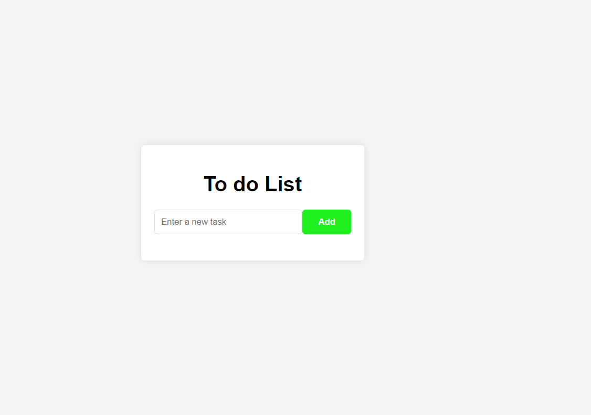
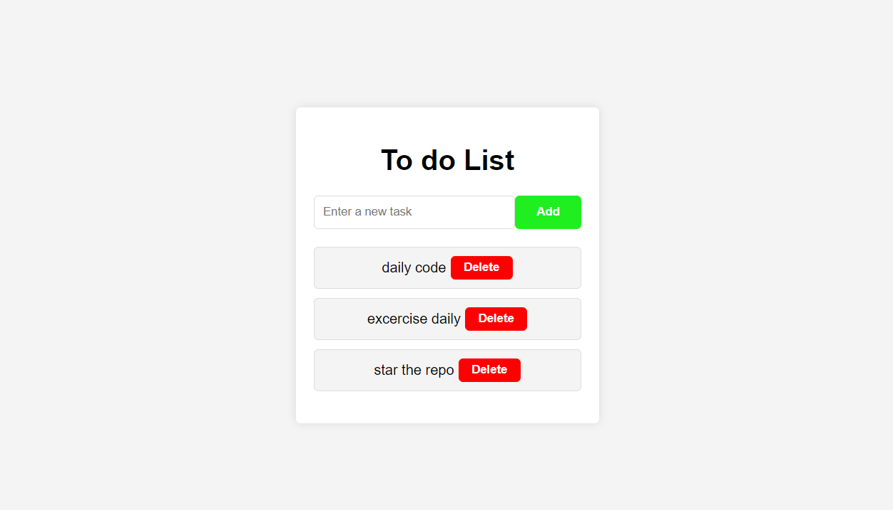

# To-Do List Application

This is a simple To-Do List application built using HTML, CSS, and JavaScript. The application allows users to add tasks to a list and delete them when they are done.

## Preview



## Approach

The approach for creating the To-Do List application involves:

1. **HTML Structure**: Setting up the basic structure with a form for task input and an unordered list to display tasks.
2. **CSS Styling**: Adding minimal styling to make the application visually appealing.
3. **JavaScript Functionality**: Implementing the logic to add and remove tasks dynamically.

## Logic

The main logic of the application is implemented in JavaScript and can be broken down into the following steps:

1. **Wait for DOM Content to Load**: Ensure the DOM is fully loaded before accessing and manipulating DOM elements.
2. **Get DOM Elements**: Retrieve references to the form, task input, and task list elements.
3. **Add Task Functionality**: When the form is submitted, prevent the default form submission behavior, get the input value, and add a new task to the list.
4. **Delete Task Functionality**: Each task has a delete button. When clicked, the task is removed from the list.

## Installation

To set up the project locally, follow these steps:

1. **Clone the Repository**:
    ```sh
    git clone https://github.com/curious-abhi/to-do-list.git
    ```
2. **Navigate to the Project Directory**:
    ```sh
    cd to-do-list
    ```

## Usage

To use the To-Do List application:

1. Open `index.html` in your web browser.
2. Enter a task in the input field and click "Add Task" to add it to the list.
3. Click the "Delete" button next to a task to remove it from the list.
